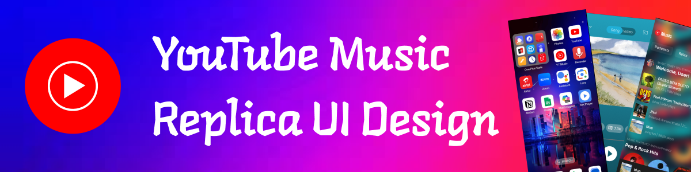

# YouTube Music Replica UI Design



## 📱 Project Overview

A comprehensive UI/UX design replica of YouTube Music, created in Figma. This project demonstrates modern interface design principles, component-based design systems, and responsive layouts for music streaming applications.

**Figma Project Link:** [YouTube Music Replica](https://www.figma.com/design/SH6he3w9ZZR7zGxYKi2UEO/YT-Music-Replica?node-id=0-1&t=iGUQMooFGZMQML0A-1)

## 🎨 Design Features

- **Pixel-perfect replica** of YouTube Music's interface
- **Responsive layouts** for various device sizes
- **Component-based design system** for consistency and scalability
- **Dark mode implementation** for enhanced visual experience
- **Interactive prototypes** demonstrating key user flows

## 📂 Repository Structure

```
.
├── design-assets/           # Exported design assets
│   ├── screens/             # Full screen exports
│   ├── components/          # Component exports
│   └── icons/               # Icon assets
├── docs/                    # Documentation files
│   ├── design-system.md     # Design system documentation
│   └── user-flows.md        # Key user flow documentation
└── figma-link.md            # Direct Figma project links
```

## 🖼️ Screenshots

<div align="center">
  
  
  
</div>

## 🛠️ Design Tools & Technologies

- **Figma** - Primary design tool
- **Auto Layout** - For responsive components
- **Components & Variants** - For scalable design systems
- **Smart Animate** - For interactive prototypes
- **Variables** - For theming and dark mode

## 🔮 Design Decisions

### Color Palette

- Primary: `#FF0000`
- Background (Dark): `#121212`
- Background (Light): `#FFFFFF`
- Text Primary: `#FFFFFF`
- Text Secondary: `#B3B3B3`

### Typography

- **Font Family:** YouTube Sans, Roboto
- **Headings:** YouTube Sans Bold
- **Body:** Roboto Regular

## 🔄 How to Use This Design

1. **View the Figma File:** Open the [Figma link](https://www.figma.com/design/SH6he3w9ZZR7zGxYKi2UEO/YT-Music-Replica?node-id=0-1&t=iGUQMooFGZMQML0A-1)
2. **Explore Components:** Check the components page for reusable elements
3. **View Prototypes:** Interact with the prototype mode to see animations and interactions

## 📋 Implementation Notes

This design is created for educational and portfolio purposes. The repository includes all necessary assets for developers to implement this design in a real application.

## 🔜 Future Improvements

- Add light mode variants
- Expand tablet and desktop layouts
- Create additional pages and features
- Implement accessibility improvements

## 📝 License

This project is for educational purposes only and is not affiliated with YouTube or Google.

## 👤 About the Designer

[Your Name] - UI/UX Designer passionate about creating intuitive and visually appealing interfaces.

[LinkedIn](your-linkedin) | [Portfolio](your-portfolio) | [Twitter](your-twitter)

---

⭐ If you find this project helpful, please consider giving it a star!
