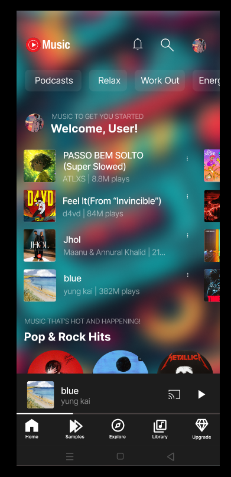
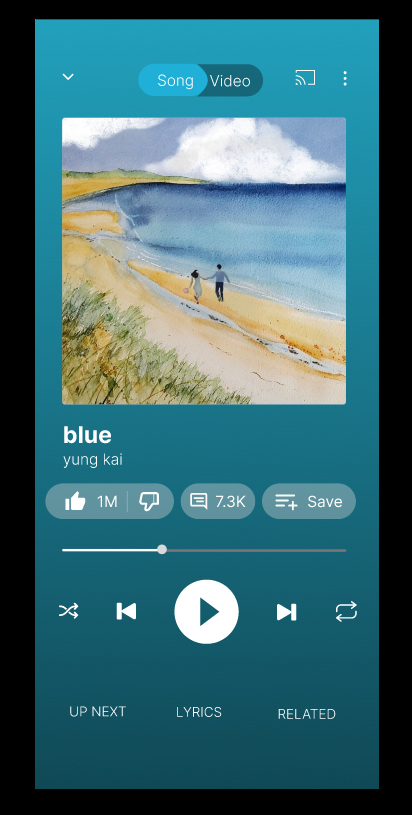
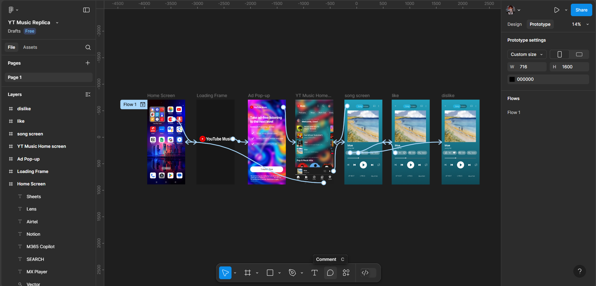

# YouTube Music Replica UI Design


## 📱 Project Overview

A comprehensive UI/UX design replica of YouTube Music, created in Figma. This project showcases a complete user flow from app launcher to player experience with multiple screens including home interface and music player. The design demonstrates modern interface principles, interactive prototyping, and attention to detail in replicating the YouTube Music mobile experience.

**Figma Project Link:** [YouTube Music Replica](https://www.figma.com/design/SH6he3w9ZZR7zGxYKi2UEO/YT-Music-Replica?node-id=0-1&t=iGUQMooFGZMQML0A-1)

## 🎨 Design Features

- **Detailed interface replica** of YouTube Music's mobile app
- **Complete user journey** from app launcher to music player
- **Interactive prototype** with connected screens and transitions
- **Like/dislike interactions** demonstrated in the player screen
- **Song details page** with engagement metrics and player controls
- **Home screen with personalized recommendations** and categorized content
- **Custom background gradients** matching YouTube Music's aesthetic

## 📂 Repository Structure

```
.
├── design-assets/                # Exported design assets
│   ├── screens/                  # Full screen exports
│   │   ├── prototype-flow.png    # Figma prototype flow overview
│   │   ├── app-launcher.png      # Home screen with YT Music icon
│   │   ├── home-screen.png       # YT Music home interface
│   │   └── music-player.png      # Music player for "blue" by yung kai
│   ├── components/               # Component exports
│   └── icons/                    # Icon assets
├── docs/                         # Documentation files
│   ├── design-system.md          # Design system documentation
│   └── user-flows.md             # Key user flow documentation
└── figma-link.md                 # Direct Figma project links
```

## 🖼️ Screenshots

<div align="center">
  
  
</div>

### Prototype Flow


The project includes a complete user flow from app launcher to player experience, with interactive elements and transitions.

## 🛠️ Design Tools & Technologies

- **Figma** - Primary design tool
- **Interactive Prototype Flows** - Connected screens with transitions
- **Components & Variants** - For consistent UI elements across screens
- **Smart Animate** - For smooth screen transitions
- **Custom Design Systems** - Replicating YouTube Music's visual language

## 🔮 Design Decisions

### Featured Song

The design showcases "blue" by yung kai as the featured track, with:
- Cover art featuring a beach scene with two people walking
- Engagement metrics (1M likes, 7.3K comments)
- Player controls and progress bar

### Color Palette

- Primary: `#FF0000` (YouTube Red)
- Player Background: `#0D7377` (Teal)
- Background (Dark): `#121212`
- Gradient Background: Deep blue to purple gradient
- Text Primary: `#FFFFFF`
- Text Secondary: `#B3B3B3`

### Typography

- **Font Family:** System fonts optimized for mobile display
- **Song Title:** Bold weight for emphasis
- **Artist Name:** Regular weight for hierarchy

## 🔄 How to Use This Design

1. **View the Figma File:** Open the [Figma link](https://www.figma.com/design/SH6he3w9ZZR7zGxYKi2UEO/YT-Music-Replica?node-id=0-1&t=iGUQMooFGZMQML0A-1)
2. **Explore Components:** Check the components page for reusable elements
3. **View Prototypes:** Interact with the prototype mode to see animations and interactions

## 📋 Implementation Notes

This design is created for educational and portfolio purposes. The repository includes all necessary assets for developers to implement this design in a real application.

## 🔜 Future Improvements

- Add light mode variants
- Expand tablet and desktop layouts
- Create additional pages and features
- Implement accessibility improvements

## 📝 License

This project is for educational purposes only and is not affiliated with YouTube or Google.

## 👤 About the Designer

[Your Name] - UI/UX Designer passionate about creating intuitive and visually appealing interfaces.

[LinkedIn](your-linkedin) | [Portfolio](your-portfolio) | [Twitter](your-twitter)

---

⭐ If you find this project helpful, please consider giving it a star!
